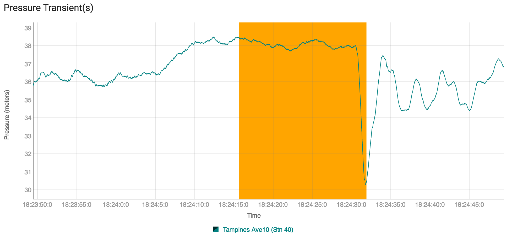

# visenti-interview-task
Create a react dygraph component using the given data

This project is made by create-react-app package. The purpose of this project is to create a fork and complete the below task. Only those candidates informed by Visenti team must submit PRs. Drop an email to the corresponding POC about the submission to find the result.

## Your task
Please create a resuable react component that can display a Dygraph with given sample data (sample-data.json).

Use chart configuration - {"title":"Pressure Transient(s)","xlabel":"Time","ylabel":"Pressure (meters)","gridLineWidth":0.1,"labels":["Date","Tampines Ave10 (Stn 40)"],"connectSeparatedPoints":true,"axes":{"x":{"axisLabelFontSize":9}}}

Result must more or less look like below -

